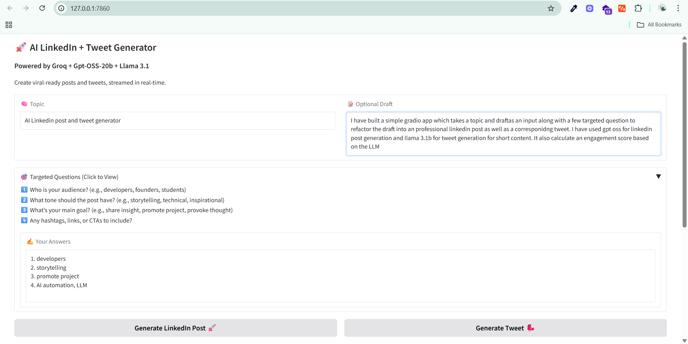

<div align="center">

# 🚀 AI LinkedIn + Tweet Generator

**Generate viral-ready LinkedIn posts and Tweets with AI-powered streaming**

[](https://gradio.app/)
[](https://groq.com/)
[](https://llama.meta.com/)


</div>


## ✨ Features

<div align="left">

🎯 **Smart Content Generation**
- Generate engaging LinkedIn posts with developer-focused narrative style
- Create punchy, viral-ready tweets optimized for engagement
- Incorporate optional drafts creatively with your topics

⚡ **Real-time Streaming**
- Watch content generate live with streaming API
- Fast generation powered by Groq infrastructure

📊 **AI-Powered Analytics**
- Automatic engagement scoring (0-10 scale)


🎨 **Intuitive Interface**
- Clean, modern Gradio web interface
- Side-by-side LinkedIn and Twitter views
- One-click copy functionality for generated content

</div>

---

## 🛠️ Installation

### Prerequisites
- Python 3.8+
- Groq API key ([Get one here](https://console.groq.com))

### Quick Start

1. **Clone the repository**
   ```bash
   git clone https://github.com/TechMaverickHub/100x-assignment-ai-post-twitter-generator.git
   cd ai-content-generator
   ```

2. **Set up virtual environment** (recommended)
   ```bash
   python -m venv venv

   # Activate virtual environment
   source venv/bin/activate      # Linux/macOS
   venv\Scripts\activate        # Windows
   ```

3. **Install dependencies**
   ```bash
   pip install -r requirements.txt
   ```

4. **Configure environment variables**

   Create a `.env` file in the project root:
   ```env
   GROQ_API_KEY=your_groq_api_key_here
   ```

   Or set it directly:
   ```bash
   export GROQ_API_KEY="your_groq_api_key_here"  # Linux/macOS
   set GROQ_API_KEY=your_groq_api_key_here       # Windows
   ```

5. **Launch the application**
   ```bash
   python app.py
   ```

6. **Open in browser**
   - Local: `http://localhost:7860`
   - Public link will be displayed in terminal

---

## 🎯 Usage Guide

### Basic Workflow

1. **Enter your topic** - The main subject for your content
   ```
   Example: "API design best practices"
   ```

2. **Add optional draft** - Any existing content to incorporate
   ```
   Example: "I learned something important about REST APIs today..."
   ```

3. **Generate content** - Click the generate button and watch the magic happen ✨

4. **Review & refine** - Edit the generated content as needed

5. **Copy & publish** - Use the built-in copy buttons to grab your content

### Content Styles

| Platform | Style | Characteristics |
|----------|-------|-----------------|
| **LinkedIn** | 📝 Blog-style narrative | Developer-focused, story-driven, insights & takeaways |
| **Twitter** | ⚡ Punchy & direct | Engaging hooks, concise, viral-optimized |

---

## 🏗️ Project Structure

```
ai-content-generator/
├── app.py                  # Main application file
├── requirements.txt        # Python dependencies
├── .env.example           # Environment variables 
├── README.md              # This file
├── screenshots/            # screenshots


```

---

## ⚙️ Technical Details

### Models & APIs
- **LinkedIn Generation**: `GPT-OSS-20b` (Groq)
- **Tweet Generation**: `llama-3.1-8b-instant` (Groq)
- **Engagement Scoring**: `llama-3.1-8b-instant` (Groq)

### Key Technologies
- **Frontend**: Gradio web interface
- **Backend**: Python
- **API**: Groq streaming API
- **AI Model**: Llama 3.1 8B Instant, GPT-OSS-20b

### Performance
- ⚡ Streaming responses for real-time updates
- 🔄 Async processing for better performance
- 📊 Concurrent generation of LinkedIn + Twitter content

---

## 🔧 Configuration

### Environment Variables

| Variable | Description | Required |
|----------|-------------|----------|
| `GROQ_API_KEY` | Your Groq API key | ✅ Yes |


---

## 📸 Screenshots (optional)

### Home 


### Generation UI


## 🤝 Contributing

We welcome contributions! Here's how you can help:

1. **Fork the repository**
2. **Create a feature branch** (`git checkout -b feature/amazing-feature`)
3. **Commit your changes** (`git commit -m 'Add amazing feature'`)
4. **Push to the branch** (`git push origin feature/amazing-feature`)
5. **Open a Pull Request**

### Development Setup

```bash
# Clone your fork
git clone https://github.com/your-username/ai-content-generator.git

---

## 🛣️ Roadmap

### Upcoming Features
- [ ] 📁 Export posts as `.txt` or `.md` files
- [ ] 🏷️ Automatic hashtag suggestions
- [ ] 📞 Smart CTA recommendations  
- [ ] 🎨 Custom themes for different industries
- [ ] 📈 Advanced engagement analytics
- [ ] 🔗 Multi-platform scheduling integration
- [ ] 🌍 Multi-language support

### Version History
- **v1.0.0** - Initial release with streaming generation
- **v1.1.0** - Added engagement scoring
- **v1.2.0** - Improved UI and error handling

---

## 📄 License

This project is licensed under the MIT License - see the [LICENSE](LICENSE) file for details.

---

## 🙏 Acknowledgments

- **Groq** for providing fast AI inference
- **Meta** for the Llama 3.1 model
- **Gradio** for the amazing web interface framework
- **Community** for feedback and contributions

---


